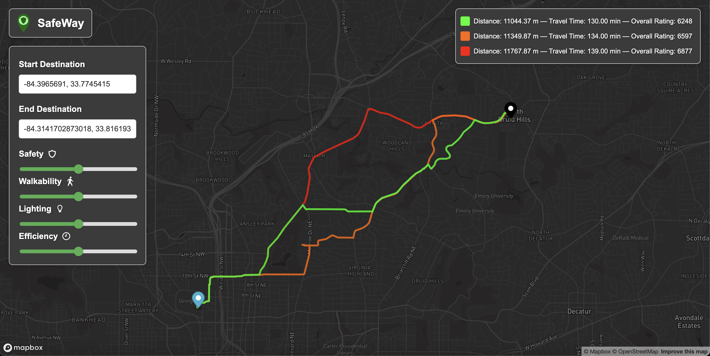

# HackGT11

Our project for HackGT11 <br />
<br />
*To run the code:*

```
git clone https://github.com/CalebBunch/hackGT11.git
```

```
cd hackGT11
```

```
terraform init
```

```
terraform apply
```

*To stop the code:*

```
terraform destroy
```

## Inspiration 💡

More often than not, Google Maps and other traditional navigation apps provide efficient routes to get to your destination, but are they always the safest? Far too often, we see people using these apps, only to end up traveling through a sketchy area, lost without any streetlights, or tripping on jagged potholes after every other step. SafeWay ensures that when you are in a new environment, you travel through only the safest, most well-lit, and best roads/walkways. SafeWay is the answer to all of your navigation needs and it will help you get to your destination safely and efficiently!

## What it does 🧐

SafeWay scrapes data from publicly available government websites to find useful information regarding high-crime areas, streetlight locations, and road quality conditions. Our software allows a user to enter a starting point and a destination for their journey. They can then change parameters to optimize their route for Safety, Walkability, Lighting, and Efficiency. SafeWay's algorithm will find three routes for your customized preferences and rank them based on how well they fit your criteria.

## How we built it 💻

We used Python and the Pandas Library to scrape and parse navigation data from the internet. We also used Python and PyMongo to build the backend of our web app, interfacing with a MongoDB Atlas Database. We used HTML, CSS, and JavaScript to develop the front-end of our app and interact with the Mapbox API to generate the map and draw the routes. We also used Flask which enabled the front-end to seamlessly interact with the backend and determine the calculated optimal routes. Finally, we used Docker and Terraform to standardize running our web app.

## Challenges we ran into 👾

Most of our team had to learn new technologies and use different libraries and frameworks that were novel to us prior to HackGT11, including Flask, MongoDB, PyMongo, and the Mapbox API. Because the application involved parsing large amounts of data, our team had to design SafeWay with performance as a foremost concern to ensure that the software runs smoothly and quickly.

## Accomplishments that we're proud of 🌟

We were able to build a highly functional app with an intuitive user interface while learning new technologies on the fly. We are proud that we tackled a real world problem and provided a compelling solution which significantly benefits users.

## What we learned 📚

We learned a lot of new programming languages and frameworks while following common practice design principles. More importantly, we learned how to collaborate as a team to get a final project we're proud of!

## What's next for SafeWay 🔮

Developing it into a native app so users can more easily use the app on their phone. We would also like to add more metrics to choose from so that the user is free to optimize for what matters most to them.

## Example 📸

Here's three optimal routes from Georgia Tech to Emory based on the weightings we set:


## Authors 👨‍💻

- [Caleb Bunch](https://github.com/CalebBunch)
- [Namit Agrawal](https://github.com/Namitagr1)
- [Alex Aridgides](https://github.com/leapingturtlefrog)
- [Shrey Agarwal](https://github.com/agshrey)
